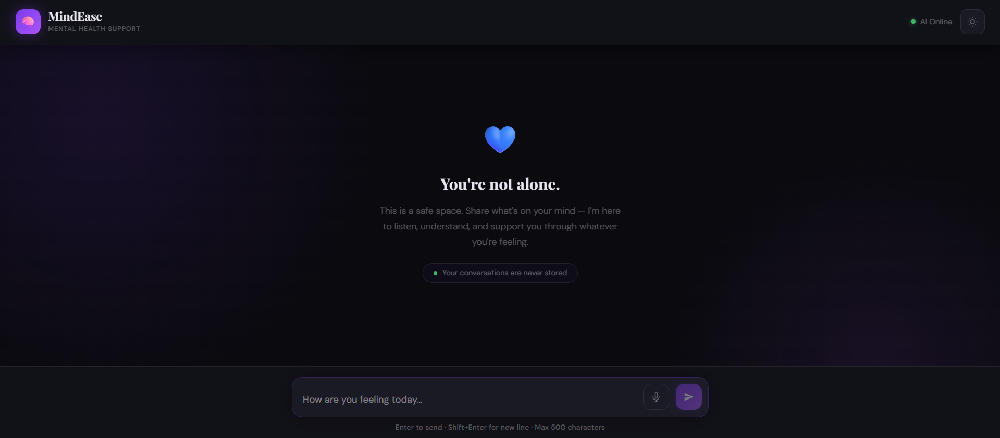
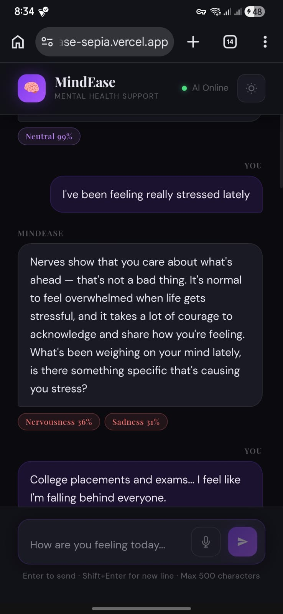

# Mental Health Chatbot

Live Demo:
https://mindease-sepia.vercel.app/

## Overview
AI-powered mental health chatbot capable of emotion-aware conversational interaction and supportive response generation.

## Features
- Emotion Detection
- NLP-based Responses
- Interactive Chat Interface
- Mental Wellness Assistance

## Technologies Used
- Python
- NLP
- Google Colab
- Vercel

# Screenshots

## Home Page
(Home Page [Mobile].png)

## Emotion Detection

